## Отчет по лабораторной работе № 1

#### № группы: `ПМ-2402`

#### Выполнил: `Минина Анастасия Владимировна`

#### Вариант: `17`

### Cодержание:

- [Постановка задачи](#1-постановка-задачи)
- [Входные и выходные данные](#2-входные-и-выходные-данные)
- [Выбор структуры данных](#3-выбор-структуры-данных)
- [Алгоритм](#4-алгоритм)
- [Программа](#5-программа)
- [Анализ правильности решения](#6-анализ-правильности-решения)

### 1. Постановка задачи

> На вход программы подаются четыре целых числа A, B, C, D. Необходимо определить число, имеющее наименьший остаток
> от деления на число X. На вход программы подаются натуральное число X и четыре целых числа A, B, C, D.


Данную задачу можно разделить на 3 подзадачи: нахождение остатков, определение наименьшего остатка и определение числа,
имеющего наименьший остаток от деления на x.

- Для 1 подзадачи нужно рассмотреть 3 случая:
    1. `A >= 0`
    2. `A < 0 && A % X != 0` (нахождение остатка от деления отрицательного числа на x)
    3. `A % X == 0`
- Аналогично для чисел b, c, d.

Всего надо рассмотреть `3 * 4 = 12` случаев.

### 2. Входные и выходные данные

#### Данные на вход

На вход программа должна получать 1 натуральное число и 4 целых числа.

|             | Тип               | min значение    | max значение     |
|-------------|-------------------|-----------------|------------------|
| X (Число 1) | Натуральное число | 1               | 2<sup>31</sup>-1 |
| A (Число 2) | Целое число       | -2<sup>31</sup> | 2<sup>31</sup>-1 |
| B (Число 3) | Целое число       | -2<sup>31</sup> | 2<sup>31</sup>-1 |
| C (Число 4) | Целое число       | -2<sup>31</sup> | 2<sup>31</sup>-1 |
| D (Число 5) | Целое число       | -2<sup>31</sup> | 2<sup>31</sup>-1 |

#### Данные на выход

Программа должна вывести число, имеющее наименьший остаток от деления на x, но остатки могут совпадать,
поэтому на выходе мы можем получить от одного до четырех целых чисел, не превышающих 2<sup>31</sup>-1.


|         | Тип         | min значение    | max значение     |
|---------|-------------|-----------------|------------------|
| Число 1 | Целое число | -2<sup>31</sup> | 2<sup>31</sup>-1 |

### 3. Выбор структуры данных

Программа получает 1 натуральное число и 4 целых числа. Для их хранения
можно выделить 5 переменных (`x`, `a`, `b`, `c` и `d`) типа `int`.

|             | название переменной | Тип (в Java) | 
|-------------|---------------------|--------------|
| X (Число 1) | `x`                 | `int`        |
| A (Число 2) | `a`                 | `int`        | 
| B (Число 3) | `b`                 | `int`        | 
| C (Число 4) | `c`                 | `int`        | 
| D (Число 5) | `d`                 | `int`        | 

Для вывода результата необязательно его хранить в отдельной переменной.

### 4. Алгоритм

#### Алгоритм выполнения программы:

1. **Ввод данных:**  
   Программа считывает одно натуральное число, обозначенное как `x`, и четыре целых числа, обозначенные как `a`, `b`,
   `c`, `d`.

2. **Нахождение остатков:**  
   Рассматриваем значение `а` и проверяем, отрицательное ли число или неотрицательное.
    - Если `а` неотрицательное, то просто находим остаток от деления числа `а` на `х`.
    - Если `а` отрицательное и не делится нацело на `х`, то:
        1. находим модуль неполного частного от деления числа `a` на `x`
        2. увеличиваем это число на 1
        3. умножаем полученное число на натуральный делитель `x`
        4. прибавляем к полученному числу отрицательное целое делимое `a`
    - Если `a` отрицательное и делится нацело на `x`, то остаток равен нулю. Переменной, отвечающей за хранение остатка,
   изначально присвоено значение 0, значит ничего не меняется.  
           
   Аналогично для чисел `b`, `c` и `d`.

3. **Определение наименьшего остатка:**

   Определяем наименьший остаток, используя функцию `Math.min()`.

4. **Определение числа, имеющего наименьший остаток**

   Сравниваем остатки, полученные во втором пункте, с наименьшим остатком. Если остатки совпадают, то выводим
   число, имеющее этот остаток.
5. **Вывод результата:**  
   На экран выводится от одного до четырех чисел (`a`, `b`, `c`, `d`).

#### Блок-схема

```mermaid
graph TD
    A([Начало]) --> B[/Ввести: x/]
    B --> C[/Ввести: a, b, c, d/]
    C --> D{a >= 0}
    D -- Да --> E[a_ost = a % x]
    D -- Нет -->F1{a % x != 0}
    F1 -- Да  --> F["a_ost = (-(a / x) + 1) * x + a"]
    F1 -- Нет --> G
    E --> G{b>=0}
    F --> G
    G -- Да --> H[b_ost = b % x]
    G -- Нет --> I1{b % x != 0}
    I1 -- Да --> I["b_ost = (-(b / x) + 1) * x + b"]
    I1 -- Нет --> J
    H --> J{c>=0}
    I --> J
    J -- Да --> K[c_ost = c % x]
    J -- Нет --> L1{c % x != 0}
    L1 -- Да -->L["c_ost = (-(c / x) + 1) * x + c"]
    L1 -- Нет --> M
    K --> M{d>=0}
    L --> M
    M -- Да --> N[d_ost = d % x]
    M -- Нет --> O1{d % x != 0}
    O1 -- Да --> O["d_ost = (-(d / x) + 1) * x + d"]
    O1 -- Нет --> P
    N --> P[min_ost = 0]
    O --> P
    P --> Q["min_ost = Math.min(min_ost, a_ost)"]
    Q --> R["min_ost = Math.min(min_ost, b_ost)"]
    R --> S["min_ost = Math.min(min_ost, c_ost)"]
    S --> T["min_ost = Math.min(min_ost, d_ost)"]
    T --> U{min_ost == a_ost}
    U -- Да --> V[/Вывод: a/]
    U -- Нет --> W{min_ost == b_ost}
    V --> W
    W -- Да --> X[/Вывод: b/]
    W -- Нет --> Y{min_ost == c_ost}
    X --> Y
    Y -- Да --> Z[/Вывод: c/]
    Y -- Нет --> A1{min_ost == d_ost}
    Z --> A1
    A1 -- Да --> B1[/Вывод: d/]
    A1 -- Нет --> C1([Конец])
    B1 --> C1

```



### 5. Программа

```java
import java.io.PrintStream;
import java.util.Scanner;
public class Main {
   // Объявляем объект класса Scanner для ввода данных
   public static Scanner in = new Scanner(System.in);
   // Объявляем объект класса PrintStream для вывода данных
   public static PrintStream out = System.out;
   public static void main(String[] args) {
      //Считывание натурального числа x из консоли
      out.print("Введите натуральный делитель x: ");
      int x = in.nextInt();
      //Считывание четырех целых чисел из консоли
      out.print("Введите четыре целых делимых:\n");
      out.print("a = ");
      int a = in.nextInt();
      out.print("b = ");
      int b = in.nextInt();
      out.print("c = ");
      int c = in.nextInt();
      out.print("d = ");
      int d = in.nextInt();
      //Вводим переменные, которые будут содержать остатки от деления
      int a_ost = 0;
      int b_ost = 0;
      int c_ost = 0;
      int d_ost = 0;
      //Определяем остаток от деления числа a на число x
      if (a >= 0){
         //Если число a >= 0, то просто находим остаток от деления
         a_ost = a % x;
      }
      else {
         //Если число a < 0 и не делится нацело на число x, то:
         //1)находим модуль неполного частного от деления числа a на x
         //2)увеличиваем это число на 1
         //3)умножаем полученное число на натуральный делитель x
         //4)прибавляем к полученному числу отрицательное целое делимое a
         if (a % x != 0)
            a_ost = (-(a / x) + 1) * x + a;
      }
      //Аналогично для чисел b, c, d
      if (b >= 0){
         b_ost = b % x;
      }
      else {
         if (b % x != 0)
            b_ost = (-(b / x) + 1) * x + b;
      }
      if (c >= 0){
         c_ost = c % x;
      }
      else {
         if (c % x != 0)
            c_ost = (-(c / x) + 1) * x + c;
      }
      if (d >= 0){
         d_ost = d % x;
      }
      else {
         if (d % x != 0)
            d_ost = (-(d / x) + 1) * x + d;
      }
      //Находим минимальный из всех остатков
      //с помощью функции Math.min
      int min_ost = 0;
      min_ost = Math.min(a_ost, b_ost);
      min_ost = Math.min(min_ost, c_ost);
      min_ost = Math.min(min_ost, d_ost);
      out.printf("Остаток от деления а на х: %d\n", a_ost);
      out.printf("Остаток от деления b на х: %d\n", b_ost);
      out.printf("Остаток от деления c на х: %d\n", c_ost);
      out.printf("Остаток от деления d на х: %d\n", d_ost);
      out.printf("Наименьший остаток: %d\n", min_ost);
      out.print("Числа, имеющие наименьший остаток от деления на x:");
      //Определяем числа, имеющие наименьший остаток от деления на x:
      //если минимальный остаток совпадает с остатком,
      //полученным от деления одного из чисел a, b, c, d на x, то
      //выводим число, которое было поделено на x
      if (min_ost == a_ost)
         out.printf(" %d", a);
      if (min_ost == b_ost)
         out.printf(" %d", b);
      if (min_ost == c_ost)
         out.printf(" %d", c);
      if (min_ost == d_ost)
         out.printf(" %d", d);
   }
}
```

### 6. Анализ правильности решения

Программа работает корректно на всем множестве решений с учетом ограничений.

1. Тест на `A >= 0, B < 0, C == 0, D % X == 0, (X == 5)`:

    - **Input**:
        ```
        5 7 -6 0 10
        ```

    - **Output**:
        ```
        0 10
        ```

2. Тест на ограничение задачи:

    - **Input**:
        ```
        2 2147483647 -2147483648 6 9
        ```

    - **Output**:
        ```
        -2147483648 6
        ```

   
